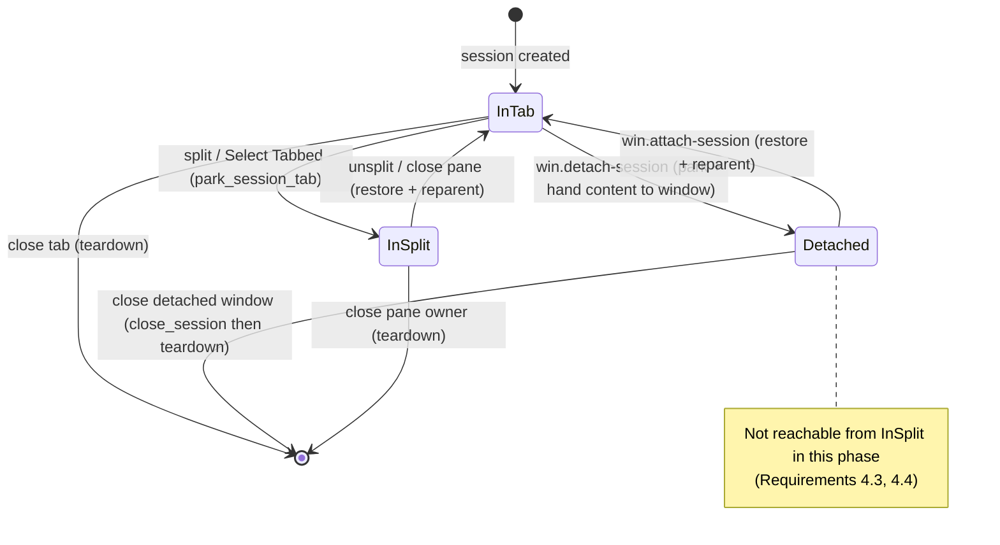
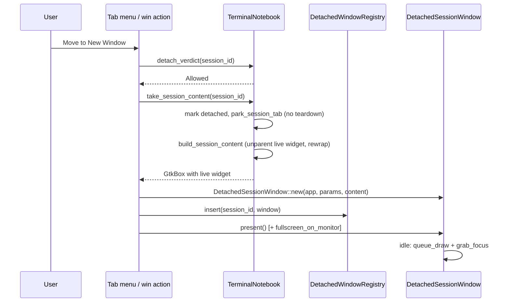
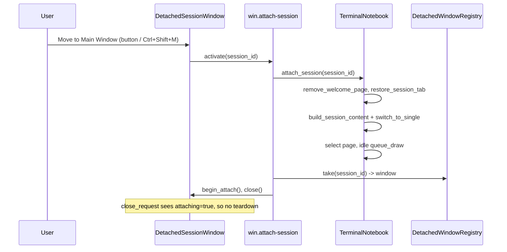

# Design Document

## Overview

Detach moves a live session out of the main window's `adw::TabView` into its own top-level window; attach moves it back. This design keeps `TerminalNotebook` as the single owner of all session state and treats a detached window as a **pure view host** that borrows the session's widget subtree. No second `adw::TabView` is created, so tab bookkeeping, teardown, and every existing per-session map stay in exactly one place.

The mechanism already exists in production for split-view guests:

| Existing operation (split view) | Reused for |
| --- | --- |
| `park_session_tab` — drop the `TabPage`, skip teardown | detach step 2 |
| `restore_session_tab` — recreate the `TabPage` | attach step 1 |
| `reparent_terminal_to_tab` / `reparent_embedded_to_tab` — move the live widget and rewrap it | both directions |
| `close_session` — full teardown for a session with no tab | detached-window close |

The main new code is therefore not the widget move: it is the window shell, the action plumbing that makes a second window a first-class citizen, and the lifecycle bookkeeping (Requirements 5 and 6).

Two pieces of dead code are consumed by this feature: `rustconn/src/external_window.rs` (`ExternalWindow` / `ExternalWindowManager`, never constructed) is replaced by `rustconn/src/detached_window.rs`, and the `MainWindow::external_window_manager` field loses its `dead_code` expectation by becoming `detached_windows`.

## Architecture

### Where a session's widget can live



`InSplit → Detached` is blocked by the detachability predicate rather than by the absence of a code path, which keeps a later phase cheap.

### Detach flow



`take_session_content` is atomic from the caller's point of view: it either returns a content box with the live widget inside and the session marked detached, or it returns `None` and leaves the session untouched (Requirement 1.8).

### Attach flow



The `attaching` flag is what separates "the window is going away because the session moved" from "the window is going away because the user closed it" — the same distinction `parked_in_split` makes for tabs.

### Ownership and reference model

- `TerminalNotebook` keeps every session map. A detached window stores only `session_id`, `connection_id`, its GTK widgets, and callbacks.
- `DetachedWindowRegistry` (owned by `MainWindow`, shared as `Rc`) owns the `DetachedSessionWindow` values.
- Callbacks installed into a detached window (`on_attach`, `on_close`) capture a `Weak<TerminalNotebook>` and a `Weak<DetachedWindowRegistry>`, never a strong clone, so no cycle keeps the notebook alive (Requirement 10.4).
- GTK keeps the window alive through the application while it is presented; dropping the registry entry plus `window.close()` releases it.

## Components and Interfaces

### 1. Detachability predicate — `rustconn-core` (Requirements 4.1–4.6, 10.2)

New GUI-free module `rustconn-core/src/session_placement.rs`, re-exported from `lib.rs`:

```rust
/// Facts about a session that decide whether it can be detached.
#[derive(Debug, Clone, Copy, PartialEq, Eq)]
pub struct DetachContext {
    /// The session renders inside RustConn (VTE or an embedded viewer).
    /// Mirrors `TerminalSession::is_embedded`.
    pub renders_in_process: bool,
    /// The session's tab hosts a split layout.
    pub is_split_owner: bool,
    /// The session's widget currently lives in another tab's split layout.
    pub is_split_guest: bool,
    /// The session already has a detached window.
    pub is_detached: bool,
}

/// Why a session may or may not be detached.
#[derive(Debug, Clone, Copy, PartialEq, Eq)]
pub enum DetachVerdict {
    Allowed,
    AlreadyDetached,
    ExternalViewer,
    SplitOwner,
    SplitGuest,
}

impl DetachVerdict {
    #[must_use] pub const fn is_allowed(self) -> bool;
    /// Stable key the GUI maps to a translated explanation.
    #[must_use] pub const fn reason_key(self) -> &'static str;
}

/// Pure decision: the same input always yields the same verdict.
#[must_use]
pub const fn detach_verdict(ctx: &DetachContext) -> DetachVerdict;
```

Precedence: `AlreadyDetached` → `ExternalViewer` → `SplitOwner` → `SplitGuest` → `Allowed`. `renders_in_process == false` is exactly the external-window placeholder case (`add_embedded_session_tab` sets `is_embedded: false`), which complements the existing `Connection::uses_external_viewer()` launch-time predicate — no duplication, because this one operates on a live session rather than on a stored connection.

The Welcome tab has no `session_id`, so it never reaches the predicate; callers treat "no session for this page" as not detachable (Requirement 4.5).

### 2. `TerminalNotebook` additions — `rustconn/src/terminal/detach.rs` (Requirements 1, 2, 7)

New sibling module to `tab_menu.rs`, following the same `impl TerminalNotebook` extension pattern. New fields in `terminal/mod.rs`:

```rust
/// Sessions whose widget currently lives in a detached window and which
/// therefore have no TabPage. Session data stays alive, exactly as for
/// `parked_in_split`; the close-page handler skips teardown for them.
detached: Rc<RefCell<HashSet<Uuid>>>,
/// Invoked by `switch_to_tab` when the target session is detached, so the
/// window layer can present its window instead of selecting a tab.
on_focus_detached: Rc<RefCell<Option<Box<dyn Fn(Uuid)>>>>,
/// Invoked when the tab context menu requests a detach
/// (session_id, optional monitor index).
on_detach_request: Rc<RefCell<Option<Box<dyn Fn(Uuid, Option<u32>)>>>>,
```

Public API:

```rust
pub fn detach_verdict(&self, session_id: Uuid) -> DetachVerdict;
pub fn take_session_content(&self, session_id: Uuid) -> Option<GtkBox>;
pub fn attach_session(&self, session_id: Uuid) -> bool;
pub fn is_detached(&self, session_id: Uuid) -> bool;
pub fn detached_session_ids(&self) -> Vec<Uuid>;
pub fn detached_count(&self) -> usize;
pub fn set_on_focus_detached<F: Fn(Uuid) + 'static>(&self, callback: F);
pub fn set_on_detach_request<F: Fn(Uuid, Option<u32>) + 'static>(&self, callback: F);
```

Three existing internals change:

1. **Extract `build_session_content`.** The content-rebuilding half of `reparent_terminal_to_tab` / `reparent_embedded_to_tab` becomes `fn build_session_content(&self, session_id: Uuid) -> Option<GtkBox>`: it unparents the live widget via the existing `detach_widget_from_parent`, rewraps it exactly as the creation path does (VTE into `terminal_row` into `gtk4::Overlay` into the outer box, with the overlay re-registered in `terminal_overlays`; embedded viewers appended directly, per the documented RDP repaint constraint), and returns the outer box. `reparent_terminal_to_tab`, `attach_session`, and `take_session_content` all call it, so all three paths wrap identically by construction.
2. **Parking gains a reason.** `park_session_tab` keeps its split semantics; a private `park_tab_page(session_id)` performs the shared "close the page without teardown" step, and the `close-page` handler's skip condition becomes `parked_in_split.contains(id) || detached.contains(id)`. `restore_session_tab` clears whichever set the session is in and becomes `pub(crate)` so `attach_session` can use it.
3. **`switch_to_tab` routes detached sessions.** When `detached.contains(session_id)`, it fires `on_focus_detached` and returns. This makes every existing focus call site correct with no edits: sidebar activation, the session manager dialog (`window/sessions.rs`), and workspace restore (`window/workspaces.rs`) — Requirement 3.6. Sidebar activation reaches it indirectly, and nothing under `sidebar/` calls it: the list view's `connect_activate` handler in `window/mod.rs` goes through `connect_at_position_with_split` → `focus_embedded_session`, which resolves the target from `session_info` (detached sessions included — they have no tab) and then calls `switch_to_tab`.

`attach_session` order matters: `remove_welcome_page()` runs **before** `restore_session_tab` inserts into `sessions`, because `remove_welcome_page` keys off `sessions.borrow().is_empty()` (Requirement 2.6). Tab title, icon, tooltip, and group or protocol color are re-derived from the surviving `session_info` entry, which is what `restore_session_tab` already does, plus a re-application of `apply_group_color` / `apply_protocol_color` (Requirement 2.3).

`session_count()` stays "sessions with a tab" so split and Welcome behavior do not change; callers that need the true total use `session_count() + detached_count()`.

### 3. `DetachedSessionWindow` and registry — `rustconn/src/detached_window.rs` (Requirements 5, 6, 8)

Replaces `rustconn/src/external_window.rs`, which is deleted along with the `SharedExternalWindowManager` alias in `window/types.rs`. Naming follows M-CONCISE-NAMES (`Registry`, not `Manager`).

```rust
pub struct DetachedWindowParams<'a> {
    pub session_id: Uuid,
    pub connection_id: Uuid,
    pub title: &'a str,
    pub protocol: &'a str,
}

pub struct DetachedSessionWindow { /* window, session_id, connection_id, toast_overlay,
                                     attach_button, attaching: Rc<Cell<bool>>, callbacks */ }

impl DetachedSessionWindow {
    #[must_use]
    pub fn new(app: &adw::Application, params: &DetachedWindowParams<'_>, content: &GtkBox) -> Self;
    pub fn present(&self);
    pub fn present_fullscreen_on(&self, monitor: &gdk::Monitor);
    pub fn set_session_title(&self, title: &str);
    pub fn toast_overlay(&self) -> &adw::ToastOverlay;
    pub fn window(&self) -> &adw::ApplicationWindow;
    /// Marks the pending close as an attach so the close handler skips teardown.
    pub fn begin_attach(&self);
    pub fn close(&self);
    pub fn set_on_attach<F: Fn(Uuid) + 'static>(&self, f: F);
    pub fn set_on_close<F: Fn(Uuid) + 'static>(&self, f: F);
}

pub struct DetachedWindowRegistry { windows: RefCell<HashMap<Uuid, DetachedSessionWindow>> }

impl DetachedWindowRegistry {
    #[must_use] pub fn new() -> Self;
    pub fn insert(&self, window: DetachedSessionWindow);
    pub fn take(&self, session_id: Uuid) -> Option<DetachedSessionWindow>;
    pub fn present(&self, session_id: Uuid) -> bool;
    #[must_use] pub fn contains(&self, session_id: Uuid) -> bool;
    #[must_use] pub fn count(&self) -> usize;
    pub fn close_all(&self);
    pub fn with_window<F, R>(&self, session_id: Uuid, f: F) -> Option<R>
    where F: FnOnce(&DetachedSessionWindow) -> R;
}
```

Window structure (Requirements 5.1, 5.4, 5.8, 9.2, 9.3):

```text
adw::ApplicationWindow  (title "<connection> — RustConn", 900x650 default, 400x300 min)
└── adw::ToastOverlay
    └── adw::ToolbarView
        ├── top bar: adw::HeaderBar
        │             title widget: adw::WindowTitle(connection name, protocol)
        │             start: Button "view-restore-symbolic" -> win.attach-session
        └── content: the GtkBox handed over by take_session_content
```

The attach button carries both `set_tooltip_text(i18n("Move to Main Window"))` and `accessible::Property::Label`. `content` is placed directly, so the session's monitoring bar and highlight overlay travel with it.

Construction also performs the per-window wiring that the main window gets in `app.rs`:

- `crate::app::install_layout_independent_accels(window.upcast_ref(), app)` (Requirement 5.5)
- `crate::app::watch_window_for_compact(window.upcast_ref())` plus the initial compact application (Requirement 5.6; the existing `set_compact_prefs` already iterates `gtk_app.windows()`, so live preference changes need no new code)
- an idle `queue_draw` on the content plus `grab_focus` on the session widget (Requirements 1.4, 1.6)

`connect_close_request`:

```rust
if attaching.get() {
    return glib::Propagation::Proceed; // moved, not closed
}
if let Some(cb) = on_close.borrow().as_ref() {
    cb(session_id); // -> notebook.close_session(session_id)
}
glib::Propagation::Proceed
```

`close_session` already recreates the tab unselected and runs the standard `close-page` teardown, which kills the VTE process group, disconnects embedded widgets, drops the SSH tunnel, and notifies the sidebar and history — Requirements 6.1 and 6.2 come from reusing it rather than duplicating teardown.

### 4. Window actions — `rustconn/src/window/detach_actions.rs` (Requirements 3, 5.2, 5.3)

New `impl MainWindow` module registered from `setup_actions`:

| Action | Parameter | Registered on | Behavior |
| --- | --- | --- | --- |
| `win.detach-session` | `String` (session UUID) | main window | verdict check, then detach; on a rejected verdict show the translated reason |
| `win.detach-session-to-monitor` | `(String, u32)` | main window | as above, then `present_fullscreen_on` |
| `win.attach-session` | `String` (session UUID) | main window and each detached window | `attach_session` plus close the window |
| `win.toggle-detach` | none | main window: detach the active session; detached window: attach its own session | the single accelerator entry point |

`win.toggle-detach` is deliberately one action name registered on both windows with different handlers. GTK resolves `win.*` against the focused window, so one accelerator gives the toggle behavior of Requirement 3.5 without two actions competing for the same accelerator.

Session-scoped actions added to each detached window so shortcuts act on its own session and never on the main window's selection (Requirements 5.2, 5.3):

| Action on detached window | Handler |
| --- | --- |
| `win.copy` | `notebook.get_terminal(session_id)`, `text_selected`, clipboard; embedded viewers keep their own handling |
| `win.paste` | `notebook.get_terminal(session_id).paste_clipboard()` |
| `win.terminal-search` | `show_terminal_search_dialog` parented to the detached window, scoped to `session_id` |
| `win.close-tab` | `notebook.close_session(session_id)` (Ctrl+W closes the detached session) |
| `win.toggle-fullscreen` | fullscreen or unfullscreen this window |
| `win.toggle-passthrough` | delegates to the existing app-level passthrough toggle |
| `win.attach-session`, `win.toggle-detach` | as above |

Actions not registered on a detached window (`win.search`, `win.new-connection`, `win.command-palette`, tab navigation) simply do not resolve there, which is the correct outcome: those operate on the sidebar and the tab strip, both of which live in the main window. Font zoom keeps working through the existing Ctrl+scroll controller on the VTE widget, which travels with the widget.

Focus-based accelerator suspension already works unchanged: `attach_focus_passthrough` is installed on the widget at creation time and the `on_terminal_focus` listener toggles **application-level** accelerators, so it fires from whichever window holds the widget (Requirement 5.5).

### 5. Tab context menu — `rustconn/src/terminal/tab_menu.rs` (Requirements 3.1, 3.2, 4.3, 8.2, 8.3)

- `connect_setup_menu` computes `detach_verdict` for the right-clicked page and passes `can_detach: bool` into `populate_tab_context_menu`, which gains a section directly above the close section:
  - `Move to New Window` -> `tab.detach`
  - `Move to New Window on…` submenu -> `tab.detach-to-monitor` with the monitor index as target, built from `gdk::Display::monitors()` and emitted only when more than one monitor is present (Requirements 8.2, 8.3)
- The section is omitted entirely when `can_detach` is false, so no inert item is shown (Requirement 3.2). A split owner tab is the one case that still shows the item — activating it explains that the split must be removed first (Requirement 4.3), because silently hiding it there is more confusing than explaining it.
- The `tab.detach` handler resolves the page to a `session_id` through `sessions` (the pattern already used by `tab.set-group`) and fires `on_detach_request`, keeping the `tab` action group free of window dependencies.

### 6. Keybindings and shortcuts dialog (Requirements 3.4, 3.5)

- `rustconn-core/src/config/keybindings.rs`: add `KeybindingDef::new("win.toggle-detach", "<Control><Shift>m", "Move Session to New Window", Terminal)`. `<Control><Shift>m` is free in the current registry (`<Control>m` is Move to Group) and is multi-modifier, so `suspend_terminal_accels` keeps it live while a terminal has focus.
- `rustconn/src/dialogs/shortcuts.rs`: add the matching `ShortcutEntry` under the `Terminal` category.
- No change to `apply_keybindings`, passthrough handling, or the keybindings settings tab: all three iterate `default_keybindings()`.

### 7. Lifecycle integration — `rustconn/src/window/mod.rs`, `rustconn/src/app.rs` (Requirement 6)

- `MainWindow` field `external_window_manager: SharedExternalWindowManager` becomes `detached_windows: Rc<DetachedWindowRegistry>` and leaves the `dead_code` expectation list.
- `MainWindow::new` wires `notebook.set_on_focus_detached(...)` to `registry.present(session_id)` and `notebook.set_on_detach_request(...)` to the detach helper.
- `window.connect_close_request`: the open-session count becomes `notebook.session_count() + notebook.detached_count() + external_open` (Requirement 6.4); after the confirmation passes, `detached_windows.close_all()` runs before the geometry save so every detached session goes through normal teardown (Requirement 6.3). The same count change applies to the `app.quit` path in `app.rs`.
- `build_ui`'s re-activation guard changes from `app.active_window()` to the main window specifically, so a focused detached window is never mistaken for the main window (Requirement 5.7). The guard keeps a `Weak<adw::ApplicationWindow>` in the existing thread-local pattern used for `BUSY_STACK` and `EXTERNAL_SESSIONS`.
- Minimize-to-tray needs no change: it hides the main window only, and detached windows are separate toplevels (Requirement 6.6).
- Remote disconnect already routes through the notebook's per-session handling; the reconnect banner and `on_reconnect` operate on the session's content box, which now lives in the detached window, so the banner appears there (Requirements 6.5, 7.6). The detach helper registers a notebook-side hook that closes the detached window when its session disappears for any reason.

### 8. State preserved by construction (Requirement 7)

| Concern | Why it survives |
| --- | --- |
| Sidebar status, session count, history | driven by `on_page_closed` and the registries, none of which fire during a park (Requirement 7.1) |
| Monitoring bar and mode | the bar is a child of the content box that moves; `MonitoringCoordinator::suspend_monitoring` / `resume_monitoring(id, &container)` is called around the move exactly as the split path does (Requirement 7.2) |
| Recording | keyed by `session_id` in `active_recordings` / `recording_paths`, untouched by the move (Requirement 7.3) |
| Highlight rules and overlay | `session_highlight_rules` untouched; the overlay is re-registered by `build_session_content` (Requirement 7.4) |
| SSH tunnel, automation, cancel tokens | keyed by `session_id`, untouched (Requirement 7.5) |
| Tab Overview, split picker, tab count | all derive from `sessions`, which no longer holds detached sessions (Requirement 7.7) |
| Fractional scale on another monitor | `embedded_rdp` reads scale through `widget.native().surface()` on each resize, so it re-resolves after the move (Requirement 8.4) |

## Data Models

Nothing is persisted. `Connection::window_geometry` and `remember_window_position` stay reserved for external viewers and are **not** reused for detached windows, so nothing new is written to the config; detached geometry is per-session and transient (a follow-up may persist it together with workspace layout, which is out of scope here).

New in-memory state only: `TerminalNotebook::detached` (`HashSet<Uuid>`), the two new callback slots, and the `DetachedWindowRegistry` map.

## Error Handling

| Situation | Behavior |
| --- | --- |
| Detach requested for a non-detachable session | show the translated reason from `DetachVerdict::reason_key()` as a toast on the active window; no state change (Requirements 3.2, 4.3) |
| `take_session_content` cannot resolve the session or its widget | returns `None`, the session keeps its tab, an error toast is shown, and the event is logged with `tracing::warn!(session = %id, ...)` (Requirement 1.8) |
| Window construction fails after content was taken | the content is handed back through `attach_session`, restoring the tab (Requirement 1.8) |
| `attach_session` cannot rebuild the tab | returns `false`; the detached window stays open with its content and an error toast is shown there (Requirement 2.7) |
| Detached window closed while its session is already gone | the registry lookup misses, the close proceeds, and no second teardown runs (Requirement 6.2) |
| Monitor disappeared between menu build and activation | fall back to a normal `present()` without fullscreen |

Per the project error-feedback rule these are all transient, retryable failures with no risk of losing user data, so toasts are the right surface.

## Testing Strategy

**`rustconn-core` (automated, no display).** Unit and property tests for `detach_verdict`: determinism over repeated calls, verdict precedence, every combination of the four `DetachContext` flags, and `reason_key()` totality. The existing keybinding registry tests already assert unique action names and valid accelerators, so they cover the new `win.toggle-detach` entry automatically.

**`rustconn` (automated).** Existing split park and restore tests must stay green; add a check that `restore_session_tab` clears the correct set when a session was detached rather than parked, and that `session_count() + detached_count()` equals the number of live sessions across both windows.

**Manual matrix (GUI, per protocol).** For SSH, local shell, Telnet, Serial, Kubernetes, Mosh, SFTP, ZeroTrust, embedded RDP, embedded VNC, and Web (feature-gated): detach, interact, attach, and verify there was no reconnect and no visual corruption; then detach, close the window, and verify the child process is gone (`ps`), the sidebar status clears, and the history entry closes. Negative cases: SPICE and external-mode RDP/VNC offer no detach; a split owner tab explains the restriction. Cross-window: `Ctrl+Shift+M` toggles, `Ctrl+W` in a detached window closes only that session, closing the main window takes the detached windows with it, and quitting with a detached session shows the confirmation.

## Decisions and Rationale

1. **Closing a detached window ends the session.** It matches closing a tab, and it is the only way to end a session from the detached window; attach stays an explicit action.
2. **Split tabs are excluded.** Moving a `SplitViewBridge` widget would work mechanically, but the broadcast toggle, split actions, and pane focus all live in the main window's header and action set. Excluding it keeps this phase honest; the state machine leaves the transition open.
3. **One action name for the toggle.** Two actions sharing one accelerator would rely on GTK trying each shortcut until one resolves. A single `win.toggle-detach` implemented per window is deterministic.
4. **No second `adw::TabView`.** It would require reconnecting `close-page`, `setup-menu`, and the whole `tab.*` action group per view, plus a session-to-window registry for tab lookup. Deferred, with `transfer_page` (available in libadwaita 0.9.2) as the future path.
5. **`external_window.rs` is deleted, not extended.** It reparents only a `vte4::Terminal`, has no toast overlay, no action wiring, and no attach path — roughly a third of what is needed, and keeping both would leave two window abstractions in the tree.
6. **The Welcome tab may appear while a detached session runs.** If the last tab closes while a session is detached, the main window shows Welcome. That is accurate: the main window genuinely has no tabs, and the sidebar still shows the session as connected.

## Requirements Traceability

| Requirement | Covered by |
| --- | --- |
| 1.1–1.8 | Components 2, 3; detach flow |
| 2.1–2.7 | Component 2 (`attach_session`), Component 4 |
| 3.1–3.6 | Components 4, 5, 6; `switch_to_tab` routing |
| 4.1–4.6 | Component 1; Component 5 menu gating |
| 5.1–5.8 | Component 3 (window shell and per-window wiring), Component 4, Component 7 |
| 6.1–6.6 | Component 3 (close handler), Component 7 |
| 7.1–7.7 | Component 8 |
| 8.1–8.5 | Component 3 (`present_fullscreen_on`), Component 5 submenu, Component 8 |
| 9.1–9.4 | Components 3, 5 (i18n and accessible labels on every new control) |
| 10.1–10.5 | Testing Strategy; ownership model (10.4); release tasks (10.5) |
