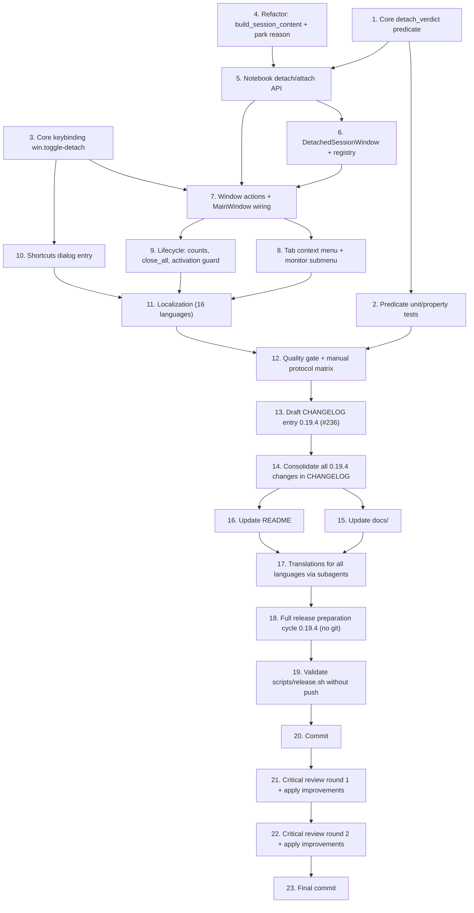

# Implementation Plan

## Overview

Closes issue #236. Phase 1 ships "one session per detached window" plus the inverse attach, for every in-process protocol (VTE sessions, embedded RDP, embedded VNC, embedded Web). Tasks 1–3 are GUI-free groundwork in `rustconn-core` (detachability predicate, its tests, the keybinding entry). Task 4 is a pure refactor of the existing park/reparent machinery with no behavior change, which every later task builds on. Tasks 5–9 add the notebook API, the detached window shell, the actions, the tab menu, and the lifecycle bookkeeping. Tasks 10–13 cover the shortcuts dialog, localization for all 16 languages, the quality gate with the manual per-protocol matrix, and the CHANGELOG entry. Tasks 14–23 are the release block for 0.19.4: changelog consolidation, documentation and README updates, subagent-driven translation of every language, the full release-preparation cycle, a `scripts/release.sh` validation run without pushing, a commit, then two rounds of critical review where a reviewing subagent finds gaps and a second subagent applies the improvements, and a final commit before manual testing.

Crate boundary holds throughout: the decision logic lives in `rustconn-core` (no gtk4/adw/vte4), every widget and window concern lives in `rustconn`.

## Task Dependency Graph



```json
{
  "waves": [
    { "wave": 1, "tasks": ["1", "3", "4"] },
    { "wave": 2, "tasks": ["2", "5"] },
    { "wave": 3, "tasks": ["6"] },
    { "wave": 4, "tasks": ["7"] },
    { "wave": 5, "tasks": ["8", "9", "10"] },
    { "wave": 6, "tasks": ["11"] },
    { "wave": 7, "tasks": ["12"] },
    { "wave": 8, "tasks": ["13", "14"] },
    { "wave": 9, "tasks": ["15", "16"] },
    { "wave": 10, "tasks": ["17"] },
    { "wave": 11, "tasks": ["18"] },
    { "wave": 12, "tasks": ["19", "20"] },
    { "wave": 13, "tasks": ["21"] },
    { "wave": 14, "tasks": ["22"] },
    { "wave": 15, "tasks": ["23"] }
  ]
}
```

## Tasks

### Groundwork (rustconn-core, GUI-free)

- [x] 1. Add the detachability predicate in rustconn-core
  - New module `rustconn-core/src/session_placement.rs` with `DetachContext` (`renders_in_process`, `is_split_owner`, `is_split_guest`, `is_detached`), `DetachVerdict` (`Allowed`, `AlreadyDetached`, `ExternalViewer`, `SplitOwner`, `SplitGuest`), `DetachVerdict::is_allowed`, `DetachVerdict::reason_key`, and `pub const fn detach_verdict(&DetachContext) -> DetachVerdict`.
  - Verdict precedence: `AlreadyDetached`, then `ExternalViewer`, then `SplitOwner`, then `SplitGuest`, then `Allowed`.
  - Keep it pure and `#[must_use]`, with `# Errors`-free canonical docs per M-CANONICAL-DOCS; no gtk4/adw/vte4 tokens.
  - Re-export from `rustconn-core/src/lib.rs` alongside the other model re-exports.
  - _Requirements: 4.1, 4.2, 4.3, 4.4, 4.6_

- [x] 2. Unit and property tests for the predicate
  - Cover: determinism across repeated calls, the full 2^4 flag matrix, precedence when several blocking conditions hold at once, and `reason_key()` returning a distinct non-empty key for every variant.
  - Place next to the existing core test suites (no GTK, no display).
  - _Requirements: 4.6, 10.2_

- [x] 3. Register the toggle keybinding in the core registry
  - Add `KeybindingDef::new("win.toggle-detach", "<Control><Shift>m", "Move Session to New Window", Terminal)` to `default_keybindings()` in `rustconn-core/src/config/keybindings.rs`.
  - Confirm the existing registry tests still pass (unique actions, valid accelerators, every category populated); no change needed in `apply_keybindings`, `set_passthrough`, or the keybindings settings tab.
  - _Requirements: 3.4, 3.5_

### Notebook groundwork (rustconn, no behavior change)

- [x] 4. Extract `build_session_content` and generalize tab parking
  - In `rustconn/src/terminal/mod.rs`, extract the content-rebuilding half of `reparent_terminal_to_tab` and `reparent_embedded_to_tab` into `fn build_session_content(&self, session_id: Uuid) -> Option<GtkBox>`: unparent the live widget with the existing `detach_widget_from_parent`, rewrap it exactly as the creation path does (VTE into `terminal_row` into `gtk4::Overlay` into the outer box, re-registering `terminal_overlays`; embedded viewers appended directly, keeping the documented RDP no-ToastOverlay repaint constraint), and return the outer box.
  - Rewrite `reparent_terminal_to_tab` in terms of it so the split path is byte-for-byte equivalent in behavior.
  - Add a private `park_tab_page(&self, session_id: Uuid)` holding the shared "close the page, skip teardown" step; keep `park_session_tab` as the split-specific caller.
  - Make `restore_session_tab` `pub(crate)` and have it clear whichever park set the session is in.
  - Verify no behavior change: split, unsplit, close pane, and Select Tabbed still work; existing tests green.
  - _Requirements: 1.2, 2.2, 10.3_

- [x] 5. Add the notebook detach/attach API
  - New module `rustconn/src/terminal/detach.rs` (`impl TerminalNotebook`, same pattern as `tab_menu.rs`).
  - New fields in `TerminalNotebook`: `detached: Rc<RefCell<HashSet<Uuid>>>`, `on_focus_detached`, `on_detach_request`.
  - Implement `detach_verdict` (builds `DetachContext` from `session_info.is_embedded`, split membership, and the `detached` set), `take_session_content`, `attach_session`, `is_detached`, `detached_session_ids`, `detached_count`, `set_on_focus_detached`, `set_on_detach_request`.
  - `take_session_content`: verdict check, mark detached, `park_tab_page`, `build_session_content`; on any failure roll back the mark and return `None`.
  - `attach_session`: `remove_welcome_page()` **before** `restore_session_tab` (so the Welcome tab is dropped), then `build_session_content`, `switch_to_single`, re-apply group/protocol color, select the page, and queue a redraw on idle.
  - Extend the `close-page` skip condition to `parked_in_split.contains(id) || detached.contains(id)`.
  - Route `switch_to_tab` through `on_focus_detached` when the session is detached, so sidebar activation, the session manager dialog, and workspace restore need no edits.
  - Call `MonitoringCoordinator::suspend_monitoring` / `resume_monitoring(id, &container)` around both moves, mirroring the split path.
  - _Requirements: 1.1, 1.2, 1.3, 1.5, 1.7, 1.8, 2.1, 2.2, 2.3, 2.5, 2.6, 2.7, 3.6, 7.2, 7.4, 7.7_

### Window layer

- [x] 6. Create the detached window shell and registry
  - New module `rustconn/src/detached_window.rs` with `DetachedWindowParams`, `DetachedSessionWindow`, and `DetachedWindowRegistry` per the design (including `begin_attach`, `present_fullscreen_on`, `toast_overlay`, `with_window`, `close_all`).
  - Window layout: `adw::ApplicationWindow` (900x650 default, 400x300 minimum, title "<connection> — RustConn") wrapping `adw::ToastOverlay` wrapping `adw::ToolbarView` with an `adw::HeaderBar` (`adw::WindowTitle` with connection name and protocol, `view-restore-symbolic` attach button with tooltip and accessible label) and the handed-over content box.
  - Per-window wiring at construction: `install_layout_independent_accels`, `watch_window_for_compact` plus the initial compact application, and an idle `queue_draw` + `grab_focus`.
  - `connect_close_request`: proceed silently when the `attaching` flag is set; otherwise fire `on_close` (which runs `notebook.close_session`) and proceed.
  - Callbacks capture `Weak` handles only — no `Rc` cycle back to `TerminalNotebook` or the registry.
  - Delete `rustconn/src/external_window.rs`, its `pub mod` line in `main.rs`, the `SharedExternalWindowManager` alias in `window/types.rs`, and the `MainWindow::external_window_manager` field.
  - _Requirements: 1.4, 1.6, 5.1, 5.4, 5.5, 5.6, 5.8, 6.1, 6.2, 8.1, 9.2, 9.3, 10.4_

- [x] 7. Add the detach/attach actions and wire MainWindow
  - New module `rustconn/src/window/detach_actions.rs` registered from `MainWindow::setup_actions`.
  - Main-window actions: `win.detach-session` (STRING session id), `win.detach-session-to-monitor` ((STRING, u32)), `win.attach-session` (STRING), `win.toggle-detach` (no param, acts on the active session).
  - Detached-window actions installed by the same module when a window is created: `win.toggle-detach` (attach this session), `win.attach-session`, `win.copy`, `win.paste`, `win.terminal-search`, `win.close-tab` (closes this session), `win.toggle-fullscreen`, `win.toggle-passthrough` — every one scoped to that window's `session_id`, never to the main window's selection.
  - Replace the `MainWindow` field with `detached_windows: Rc<DetachedWindowRegistry>`; wire `notebook.set_on_focus_detached` to `registry.present` and `notebook.set_on_detach_request` to the detach helper.
  - Rejected verdicts show the translated `reason_key()` explanation as a toast; failures follow the design's error table.
  - _Requirements: 1.1, 1.4, 1.7, 1.8, 2.1, 2.4, 2.7, 3.3, 3.4, 3.5, 3.6, 4.3, 5.2, 5.3, 8.2_

- [x] 8. Add the tab context menu entries
  - In `rustconn/src/terminal/tab_menu.rs`: compute `detach_verdict` for the right-clicked page in `connect_setup_menu` and pass `can_detach` into `populate_tab_context_menu`.
  - Add a section directly above the close section with "Move to New Window" (`tab.detach`) and, only when `gdk::Display::monitors()` reports more than one monitor, a "Move to New Window on…" submenu (`tab.detach-to-monitor` with the monitor index as target).
  - Omit the section entirely when the session is not detachable, except for a split owner tab, where activating it explains that the split must be removed first.
  - Handlers resolve the page to a `session_id` via `sessions` (the `tab.set-group` pattern) and fire `on_detach_request`.
  - _Requirements: 3.1, 3.2, 4.3, 4.5, 8.2, 8.3_

- [x] 9. Wire the window lifecycle
  - `MainWindow::connect_close_request`: open-session count becomes `session_count() + detached_count() + external_open`; after confirmation, call `detached_windows.close_all()` before the geometry save.
  - Apply the same count change to the `app.quit` path in `rustconn/src/app.rs`.
  - Change `build_ui`'s re-activation guard from `app.active_window()` to the tracked main window, so a focused detached window is never presented as the main window.
  - Register a notebook-side hook that closes a detached window when its session disappears for any reason (remote disconnect, child exit, terminate from the session manager), so no empty detached window is left behind.
  - Confirm minimize-to-tray leaves detached windows untouched.
  - _Requirements: 5.7, 6.2, 6.3, 6.4, 6.5, 6.6, 7.1_

- [x] 10. Add the shortcuts dialog entry
  - Add a `ShortcutEntry` for `<Control><Shift>m` / "Ctrl+Shift+M" — "Move session to new window" — under the `Terminal` category in `rustconn/src/dialogs/shortcuts.rs`.
  - _Requirements: 3.4_

### Release work

- [x] 11. Localize all new strings
  - Wrap every new user-facing string in `i18n()` / `i18n_f()` with `{}` placeholders: the two menu items, the monitor submenu labels, the attach button tooltip and accessible label, the window title, and the four verdict explanations.
  - Run `po/update-pot.sh`, then translate the new msgids for all 16 languages in `po/LINGUAS` (uk, de, it, fr, es, pl, cs, sk, da, sv, nl, pt, be, kk, uz, zh-cn).
  - Have the Ukrainian entries reviewed against the project's Ukrainian style guide.
  - Header capitalization for menu items, buttons, and window titles; sentence case for the explanation messages.
  - _Requirements: 9.1, 9.2, 9.3, 9.4_

- [x] 12. Quality gate and manual protocol matrix
  - `cargo fmt --all`, `cargo clippy --all-targets` with no new warnings, `cargo test` for both crates.
  - Automated additions: the core predicate tests from task 2 plus a notebook-level check that `restore_session_tab` clears the right park set and that `session_count() + detached_count()` matches the number of live sessions.
  - Manual matrix per protocol (SSH, local shell, Telnet, Serial, Kubernetes, Mosh, SFTP, ZeroTrust, embedded RDP, embedded VNC, Web): detach, interact, attach, and confirm no reconnect and no visual corruption; then detach, close the window, and confirm with `ps` that the child process is gone, the sidebar status cleared, and the history entry closed.
  - Negative cases: SPICE and external-mode RDP/VNC show no detach item; a split owner tab explains the restriction; the Welcome tab has no detach item.
  - Cross-window: Ctrl+Shift+M toggles in both directions, Ctrl+W in a detached window closes only that session, closing the main window takes detached windows with it, quitting with a detached session shows the confirmation, and re-activating the app presents the main window.
  - _Requirements: 10.1, 10.2, 10.3, 10.4, plus end-to-end verification of Requirements 1, 2, 4, 5, 6, 7, 8_

- [x] 13. Draft the CHANGELOG entry for 0.19.4
  - Add an `### Added` entry to the existing `## [0.19.4] - 2026-07-25` section describing detachable session windows, the protocols covered, the attach action, the Ctrl+Shift+M toggle, and the multi-monitor fullscreen option, referencing issue #236.
  - Note the deliberate limits: external-viewer sessions (SPICE, external RDP/VNC) already run in their own window and are not detachable, and split tabs must be unsplit first.
  - Follow the project changelog format: bold summary with the issue reference, explanation in the same bullet.
  - _Requirements: 10.5_

### Release block for 0.19.4

- [x] 14. Consolidate every 0.19.4 change in the CHANGELOG
  - Review the full `git diff` for the 0.19.4 branch and make sure the `## [0.19.4] - 2026-07-25` section describes every user-visible change made for this feature, not only the headline entry from task 13 — including the removal of the unused `external_window.rs` abstraction (`### Removed` or `### Improved`), the new `Ctrl+Shift+M` binding, and any dependency or packaging change.
  - Keep the project changelog format: bold summary with the issue reference, explanation in the same bullet, sections in the documented order, no empty sections.
  - _Requirements: 10.5_

- [x] 15. Update the documentation
  - `docs/USER_GUIDE.md`: document detaching and attaching a session, which protocols support it, the keyboard shortcut, the multi-monitor fullscreen option, and the fact that closing a detached window ends its session.
  - `docs/ARCHITECTURE.md`: add the session-placement model (tab / split / detached window), naming `TerminalNotebook` as the single owner of session state and `DetachedWindowRegistry` as the window registry.
  - Update any keyboard-shortcut reference table in `docs/` so it matches `default_keybindings()`.
  - Check whether `.kiro/steering/window-guide.md` needs a line about detached windows so future work in `rustconn/src/window/` follows the same model.
  - _Requirements: 10.5_

- [x] 16. Update the README
  - Add detachable session windows to the feature list, with a one-line description that names the supported protocols and the reverse attach action.
  - Keep the existing README structure and tone; no new top-level sections unless the feature list requires one.
  - _Requirements: 10.5_

- [x] 17. Translate all new strings for every language via subagents
  - Run `po/update-pot.sh` first so `po/rustconn.pot` carries every new msgid.
  - Dispatch one subagent per language for all 16 languages in `po/LINGUAS` (uk, de, it, fr, es, pl, cs, sk, da, sv, nl, pt, be, kk, uz, zh-cn), each instructed to translate only the untranslated/fuzzy entries introduced by this feature and to leave existing translations untouched.
  - Run the `uk-translation-reviewer` agent on `po/uk.po` afterwards.
  - Verify with `msgfmt --check` (or `po/compile-mo.sh`) that every `.po` file still compiles and that no file lost entries.
  - _Requirements: 9.1, 9.4_

- [x] 18. Run the full release preparation cycle for 0.19.4
  - Follow the `release-version` steering checklist for version 0.19.4 end to end: dependency freshness audit (cargo, CLI downloads, flatpak/flathub, nix, snap) reported before applying, changelog propagation to `debian/changelog`, `packaging/obs/*`, and the metainfo XML, version strings across the canonical `PKG_FILES` list, `cargo generate-lockfile`, `cargo-sources.json` regeneration for both flatpak and flathub, and the old-version consistency grep.
  - No git commands in this task — it only leaves a clean, consistent working tree.
  - _Requirements: 10.5_

- [ ] 19. Validate `scripts/release.sh` without pushing
  - Run `./scripts/release.sh --dry-run` and confirm it passes every validation: branch name matches the workspace version (`0.19.4`), the changelog section and its date agree with `debian/changelog` and the metainfo XML, the tag `v0.19.4` does not exist yet, and fmt/clippy/tests succeed.
  - Fix whatever the script reports and re-run until it exits 0. Do not run it without `--dry-run`, and do not use `--no-push` (which merges and tags locally) without explicit approval — no push in either case.
  - _Requirements: 10.1, 10.5_

- [ ] 20. Commit the implementation
  - Stage the specific files changed by tasks 1–19 (no `git add -A`) and create one commit following the project commit-message convention, referencing issue #236.
  - Do not push, do not amend, do not tag.
  - _Requirements: 10.5_

- [ ] 21. Critical review round 1, then apply the improvements
  - Dispatch a review subagent with this task: critically assess every change made for 0.19.4, find implementation gaps, missing cases, and possible improvements, and report them as a prioritized list with file references. Give it no write permissions in spirit — it reports, it does not edit.
  - Dispatch a second subagent to apply the accepted findings and add the resulting changes to the `## [0.19.4]` changelog section.
  - Re-run fmt, clippy, and the test suite after the changes land.
  - _Requirements: 10.1, 10.5_

- [ ] 22. Critical review round 2, then apply the improvements
  - Repeat task 21 with a fresh reviewing subagent and the same prompt, so the second pass sees the post-fix state rather than the original diff.
  - Apply the accepted findings through a second applying subagent and extend the `## [0.19.4]` changelog section again.
  - Re-run fmt, clippy, and the test suite.
  - _Requirements: 10.1, 10.5_

- [ ] 23. Final commit
  - Stage the review-driven changes explicitly and create a final commit referencing issue #236.
  - Report what changed since task 20 so manual testing can start from a known state. No push.
  - _Requirements: 10.5_
